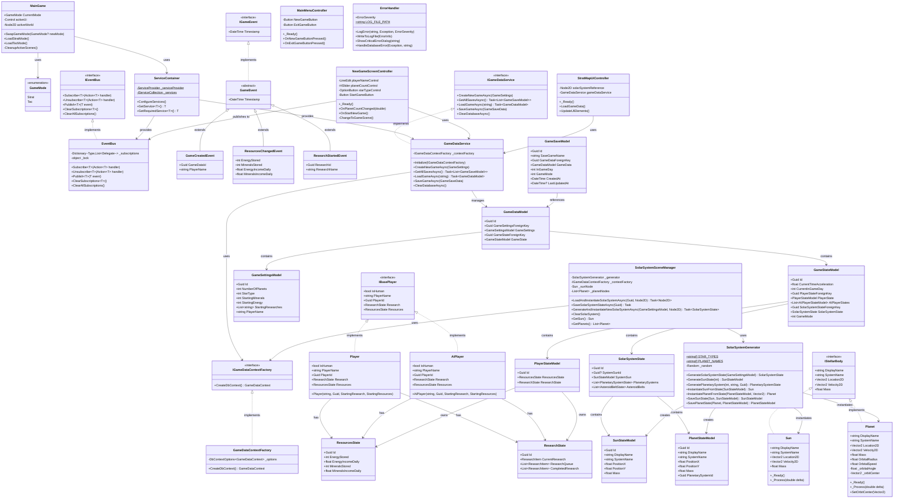

# Alien Invasion Logistics - Class Diagram

```mermaid
classDiagram
    %% Core Game Management
    class MainGame {
        +GameMode CurrentMode
        -Control activeUi
        -Node2D activeWorld
        +SwapGameMode(GameMode? newMode)
        +LoadStratMode()
        +LoadTacMode()
        -CleanupActiveScenes()
    }

    class GameMode {
        <<enumeration>>
        Strat
        Tac
    }

    class ServiceContainer {
        -ServiceProvider _serviceProvider$
        -IServiceCollection _services$
        +ConfigureServices()
        +GetService~T~() T
        +GetRequiredService~T~() T
    }

    %% Player System
    class IBasePlayer {
        <<interface>>
        +bool isHuman
        +string PlayerName
        +Guid PlayerId
        +ResearchState Research
        +ResourcesState Resources
    }

    class Player {
        +bool isHuman
        +string PlayerName
        +Guid PlayerId
        +ResearchState Research
        +ResourcesState Resources
        +Player(string, Guid, StartingResearch, StartingResources)
    }

    class AiPlayer {
        +bool isHuman
        +string PlayerName
        +Guid PlayerId
        +ResearchState Research
        +ResourcesState Resources
        +AiPlayer(string, Guid, StartingResearch, StartingResources)
    }

    %% Stellar Bodies
    class IStellarBody {
        <<interface>>
        +string DisplayName
        +string SystemName
        +Vector2 Location2D
        +Vector2 Velocity2D
        +float Mass
    }

    class Planet {
        +string DisplayName
        +string SystemName
        +Vector2 Location2D
        +Vector2 Velocity2D
        +float Mass
        +float OrbitalRadius
        +float OrbitalSpeed
        -float _orbitalAngle
        -Vector2 _orbitCenter
        +_Ready()
        +_Process(double delta)
        +SetOrbitCenter(Vector2)
    }

    class Sun {
        +string DisplayName
        +string SystemName
        +Vector2 Location2D
        +Vector2 Velocity2D
        +float Mass
        +_Ready()
        +_Process(double delta)
    }

    %% Event System
    class IEventBus {
        <<interface>>
        +Subscribe~T~(Action~T~ handler)
        +Unsubscribe~T~(Action~T~ handler)
        +Publish~T~(T event)
        +ClearSubscriptions~T~()
        +ClearAllSubscriptions()
    }

    class EventBus {
        -Dictionary~Type,List~Delegate~~ _subscriptions
        -object _lock
        +Subscribe~T~(Action~T~ handler)
        +Unsubscribe~T~(Action~T~ handler)
        +Publish~T~(T event)
        +ClearSubscriptions~T~()
        +ClearAllSubscriptions()
    }

    class IGameEvent {
        <<interface>>
        +DateTime Timestamp
    }

    class GameEvent {
        <<abstract>>
        +DateTime Timestamp
    }

    class GameCreatedEvent {
        +Guid GameDataId
        +string PlayerName
    }

    class ResourcesChangedEvent {
        +int EnergyStored
        +int MineralsStored
        +float EnergyIncomeDaily
        +float MineralsIncomeDaily
    }

    class ResearchStartedEvent {
        +Guid ResearchId
        +string ResearchName
    }

    %% Data Service Layer
    class IGameDataService {
        <<interface>>
        +CreateNewGameAsync(GameSettings)
        +GetAllSavesAsync() Task~List~GameSaveModel~~
        +LoadGameAsync(string) Task~GameDataModel~
        +SaveGameAsync(GameSaveData)
        +ClearDatabaseAsync()
    }

    class GameDataService {
        -IGameDataContextFactory _contextFactory
        +Initialize(IGameDataContextFactory)
        +CreateNewGameAsync(GameSettings)
        +GetAllSavesAsync() Task~List~GameSaveModel~~
        +LoadGameAsync(string) Task~GameDataModel~
        +SaveGameAsync(GameSaveData)
        +ClearDatabaseAsync()
    }

    class IGameDataContextFactory {
        <<interface>>
        +CreateDbContext() GameDataContext
    }

    class GameDataContextFactory {
        -DbContextOptions~GameDataContext~ _options
        +CreateDbContext() GameDataContext
    }

    %% Database Models
    class GameDataModel {
        +Guid Id
        +Guid GameSettingsForeignKey
        +GameSettingsModel GameSettings
        +Guid GameStateForeignKey
        +GameStateModel GameState
    }

    class GameSettingsModel {
        +Guid Id
        +int NumberOfPlanets
        +int StarType
        +int StartingMinerals
        +int StartingEnergy
        +List~string~ StartingResearches
        +string PlayerName
    }

    class GameSaveModel {
        +Guid Id
        +string SaveGameName
        +Guid GameDataForeignKey
        +GameDataModel GameData
        +int InGameDay
        +int GameMode
        +DateTime CreatedAt
        +DateTime? LastUpdatedAt
    }

    class GameStateModel {
        +Guid Id
        +float CurrentTimeAcceleration
        +int CurrentInGameDay
        +Guid PlayerStateForeignKey
        +PlayerStateModel PlayerState
        +List~AIPlayerStateModel~ AIPlayerStates
        +Guid SolarSystemStateForeignKey
        +SolarSystemState SolarSystemState
        +int GameMode
    }

    class PlayerStateModel {
        +Guid Id
        +ResourcesState ResourcesState
        +ResearchState ResearchState
    }

    class ResourcesState {
        +Guid Id
        +int EnergyStored
        +float EnergyIncomeDaily
        +int MineralsStored
        +float MineralsIncomeDaily
    }

    class ResearchState {
        +Guid Id
        +ResearchItem CurrentResearch
        +List~ResearchItem~ ResearchQueue
        +List~ResearchItem~ CompletedResearch
    }

    class SolarSystemState {
        +Guid Id
        +Guid? SystemSunId
        +SunStateModel SystemSun
        +List~PlanetarySystemState~ PlanetarySystems
        +List~AsteroidBeltState~ AsteroidBelts
    }

    class SunStateModel {
        +Guid Id
        +string DisplayName
        +string SystemName
        +float PositionX
        +float PositionY
        +float Mass
    }

    class PlanetStateModel {
        +Guid Id
        +string DisplayName
        +string SystemName
        +float PositionX
        +float PositionY
        +float Mass
        +Guid PlanetarySystemId
    }

    %% Solar System Generation
    class SolarSystemGenerator {
        +string[] STAR_TYPES$
        +string[] PLANET_NAMES$
        -Random _random
        +GenerateSolarSystemState(GameSettingsModel) SolarSystemState
        +GenerateSunState(int) SunStateModel
        +GeneratePlanetarySystem(int, string, Guid) PlanetarySystemState
        +InstantiateSunFromState(SunStateModel) Sun
        +InstantiatePlanetFromState(PlanetStateModel, Vector2) Planet
        +SaveSunState(Sun, SunStateModel) SunStateModel
        +SavePlanetState(Planet, PlanetStateModel) PlanetStateModel
    }

    class SolarSystemSceneManager {
        -SolarSystemGenerator _generator
        -IGameDataContextFactory _contextFactory
        -Sun _sunNode
        -List~Planet~ _planetNodes
        +LoadAndInstantiateSolarSystemAsync(Guid, Node2D) Task~Node2D~
        +SaveSolarSystemStateAsync(Guid) Task
        +GenerateAndInstantiateNewSolarSystemAsync(GameSettingsModel, Node2D) Task~SolarSystemState~
        +ClearSolarSystem()
        +GetSun() Sun
        +GetPlanets() List~Planet~
    }

    %% UI Controllers
    class NewGameScreenController {
        -LineEdit playerNameControl
        -HSlider planetCountControl
        -OptionButton starTypeControl
        -Button StartGameButton
        +_Ready()
        +OnPlanetCountChanged(double)
        +OnStartNewGame()
        -ChangeToGameScene()
    }

    class MainMenuController {
        -Button NewGameButton
        -Button ExitGameButton
        +_Ready()
        +OnNewGameButtonPressed()
        +OnExitGameButtonPressed()
    }

    class StratMapUiController {
        -Node2D solarSystemReference
        -GameDataService gameDataService
        +_Ready()
        +LoadGameData()
        +UpdateUIElements()
    }

    %% Error Handling
    class ErrorHandler {
        +ErrorSeverity
        +string LOG_FILE_PATH$
        +LogError(string, Exception, ErrorSeverity)
        +WriteToLogFile(ErrorInfo)
        +ShowCriticalErrorDialog(string)
        +HandleDatabaseError(Exception, string)
    }

    %% Relationships
    IBasePlayer <|.. Player : implements
    IBasePlayer <|.. AiPlayer : implements
    IStellarBody <|.. Planet : implements
    IStellarBody <|.. Sun : implements
    IEventBus <|.. EventBus : implements
    IGameEvent <|.. GameEvent : implements
    GameEvent <|-- GameCreatedEvent : extends
    GameEvent <|-- ResourcesChangedEvent : extends
    GameEvent <|-- ResearchStartedEvent : extends
    IGameDataService <|.. GameDataService : implements
    IGameDataContextFactory <|.. GameDataContextFactory : implements

    MainGame --> ServiceContainer : uses
    MainGame --> GameMode : uses
    ServiceContainer --> GameDataService : provides
    ServiceContainer --> EventBus : provides
    GameDataService --> IGameDataContextFactory : uses
    GameDataService --> GameDataModel : manages
    
    Player --> ResourcesState : has
    Player --> ResearchState : has
    AiPlayer --> ResourcesState : has
    AiPlayer --> ResearchState : has

    GameDataModel --> GameSettingsModel : contains
    GameDataModel --> GameStateModel : contains
    GameSaveModel --> GameDataModel : references
    GameStateModel --> PlayerStateModel : contains
    GameStateModel --> SolarSystemState : contains
    PlayerStateModel --> ResourcesState : owns
    PlayerStateModel --> ResearchState : owns
    SolarSystemState --> SunStateModel : contains
    SolarSystemState --> PlanetStateModel : contains

    SolarSystemGenerator --> SunStateModel : creates
    SolarSystemGenerator --> PlanetStateModel : creates
    SolarSystemGenerator --> Sun : instantiates
    SolarSystemGenerator --> Planet : instantiates
    SolarSystemSceneManager --> SolarSystemGenerator : uses
    SolarSystemSceneManager --> IGameDataContextFactory : uses

    NewGameScreenController --> GameDataService : uses
    NewGameScreenController --> EventBus : publishes to
    StratMapUiController --> GameDataService : uses
```
