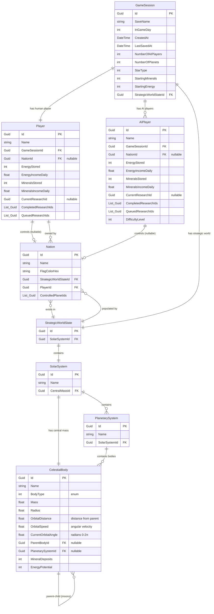

# Database Schema - Entity Relationship Diagram

## Overview Diagram



## Detailed Hierarchical View

```
┌─────────────────────────────────────────────────────────────┐
│                        GameSession                          │
│  ┌───────────────────────────────────────────────────────┐  │
│  │ Id (PK)                                               │  │
│  │ SaveName                                              │  │
│  │ InGameDay (in-game timestamp)                         │  │
│  │ CreatedAt, LastSavedAt                                │  │
│  │ Settings (embedded):                                  │  │
│  │   - NumberOfAIPlayers                                 │  │
│  │   - NumberOfPlanets                                   │  │
│  │   - StarType                                          │  │
│  │   - StartingMinerals                                  │  │
│  │   - StartingEnergy                                    │  │
│  └───────────────────────────────────────────────────────┘  │
│                                                               │
│  ┌───────────────────┐     ┌──────────────────────┐         │
│  │   HumanPlayer     │     │    AIPlayer (0..N)   │         │
│  ├───────────────────┤     ├──────────────────────┤         │
│  │ Id (PK)           │     │ Id (PK)              │         │
│  │ Name              │     │ Name                 │         │
│  │ GameSessionId (FK)│     │ GameSessionId (FK)   │         │
│  │ NationId (FK)?    │────▶│ NationId (FK)?       │────┐    │
│  │                   │     │ DifficultyLevel      │    │    │
│  │ Resources:        │     │                      │    │    │
│  │  - EnergyStored   │     │ Resources:           │    │    │
│  │  - MineralsStored │     │  - EnergyStored      │    │    │
│  │  - Income rates   │     │  - MineralsStored    │    │    │
│  │                   │     │  - Income rates      │    │    │
│  │ Research:         │     │                      │    │    │
│  │  - CurrentId      │     │ Research:            │    │    │
│  │  - CompletedIds[] │     │  - CurrentId         │    │    │
│  │  - QueuedIds[]    │     │  - CompletedIds[]    │    │    │
│  └───────────────────┘     │  - QueuedIds[]       │    │    │
│           │                └──────────────────────┘    │    │
│           │                                             │    │
│           │                 ┌───────────────────────┐  │    │
│           └────────────────▶│      Nation           │◀─┘    │
│                             ├───────────────────────┤       │
│                             │ Id (PK)               │       │
│                             │ Name                  │       │
│                             │ FlagColorHex          │       │
│                             │ PlayerId (FK)         │       │
│                             │ ControlledPlanetIds[] │       │
│                             └───────────────────────┘       │
│                                       │                     │
│  ┌────────────────────────────────────┼─────────────────┐  │
│  │         StrategicWorldState        │                 │  │
│  ├────────────────────────────────────┴─────────────────┤  │
│  │ Id (PK)                                              │  │
│  │ SolarSystemId (FK)                                   │  │
│  │ Nations[] ───────────────────────────────────────────┘  │
│  └──────────────┬───────────────────────────────────────┘  │
│                 │                                           │
│     ┌───────────▼──────────────────────────────┐           │
│     │          SolarSystem                     │           │
│     ├──────────────────────────────────────────┤           │
│     │ Id (PK)                                  │           │
│     │ Name                                     │           │
│     │ CentralMassId (FK) ──────┐               │           │
│     └──────────┬───────────────┼───────────────┘           │
│                │               │                           │
│                │         ┌─────▼───────────────────────┐   │
│                │         │    CelestialBody (Star)     │   │
│                │         ├─────────────────────────────┤   │
│                │         │ Id (PK)                     │   │
│                │         │ Name                        │   │
│                │         │ BodyType = Star             │   │
│                │         │ Mass, Radius, Position...   │   │
│                │         └─────────────────────────────┘   │
│                │                                           │
│         ┌──────▼──────────────────────┐                    │
│         │   PlanetarySystem (1..N)    │                    │
│         ├─────────────────────────────┤                    │
│         │ Id (PK)                     │                    │
│         │ Name (e.g., "Jupiter")      │                    │
│         │ SolarSystemId (FK)          │                    │
│         └──────┬──────────────────────┘                    │
│                │                                           │
│         ┌──────▼────────────────────────────────┐          │
│         │   CelestialBody (Planets/Moons)       │          │
│         ├───────────────────────────────────────┤          │
│         │ Id (PK)                               │          │
│         │ Name                                  │          │
│         │ BodyType (Planet/Moon/Asteroid)       │          │
│         │ ParentBodyId (FK)? ───────┐           │          │
│         │ PlanetarySystemId (FK)    │           │          │
│         │                           │           │          │
│         │ Physical Properties:      │           │          │
│         │  - Mass                   │           │          │
│         │  - Radius                 │           │          │
│         │                           │           │          │
│         │ Kepler Orbital Elements:  │           │          │
│         │  - OrbitalDistance        │           │          │
│         │  - OrbitalSpeed           │           │          │
│         │  - CurrentOrbitalAngle    │           │          │
│         │                           │           │          │
│         │ Game Resources:           │           │          │
│         │  - MineralDeposits        │           │          │
│         │  - EnergyPotential        │           │          │
│         └───────────────────────────┘           │          │
│                         │                       │          │
│                         └───────────────────────┘          │
│                         (self-referencing for moons)       │
└─────────────────────────────────────────────────────────────┘
```

## Relationship Cardinalities

| Entity A              | Relationship | Entity B              | Type    | Notes                          |
|-----------------------|--------------|------------------------|---------|--------------------------------|
| GameSession           | has          | Player                | 1:1     | Exactly one human player       |
| GameSession           | has          | AIPlayer              | 1:N     | Zero to many AI players        |
| GameSession           | has          | StrategicWorldState   | 1:1     | Required                       |
| Player                | controls     | Nation                | 1:0..1  | Nullable (null = defeated)     |
| AIPlayer              | controls     | Nation                | 1:0..1  | Nullable (null = defeated)     |
| Nation                | exists in    | StrategicWorldState   | N:1     | Many nations per world         |
| StrategicWorldState   | contains     | SolarSystem           | 1:1     | One solar system per world     |
| SolarSystem           | has          | CelestialBody (star)  | 1:1     | The central mass (required)    |
| SolarSystem           | contains     | PlanetarySystem       | 1:N     | One or more planetary systems  |
| PlanetarySystem       | contains     | CelestialBody         | 1:N     | Planets and their moons        |
| CelestialBody         | orbits       | CelestialBody         | N:0..1  | Self-ref: moons orbit planets  |

## CelestialBody Kepler Orbital Model

Since this is a **top-down 2D strategic game**, we use **simplified Keplerian orbits** for clean, predictable mechanics:

### Stored Properties (Kepler-Based)
| Property | Type | Purpose |
|----------|------|---------|
| `Mass` | float | Physical mass (for visual scale, future physics) |
| `Radius` | float | Visual size and collision detection |
| `OrbitalDistance` | float | Distance from parent body (radius of circular orbit) |
| `OrbitalSpeed` | float | Angular velocity (radians per in-game day) |
| `CurrentOrbitalAngle` | float | Current position in orbit (0 to 2π radians) |
| `ParentBodyId` | Guid? | What this body orbits (null for central star) |

### Why Kepler Instead of Physics?

**Advantages:**
- ✅ **Stable** - Orbits never decay or become chaotic
- ✅ **Predictable** - Players can plan around fixed orbital periods
- ✅ **Performant** - Simple trigonometry, no force calculations
- ✅ **Clean saves** - Just store current angle, not velocity vectors
- ✅ **Deterministic** - Same angle = same position always

**What We DON'T Store:**
- ❌ Position X/Y (computed on-the-fly from angle)
- ❌ Velocity X/Y (not needed for Kepler orbits)
- ❌ Complex orbital elements (eccentricity, inclination, etc.)

### Runtime Position Calculation

Position is **computed** every frame, not stored:

```csharp
/// <summary>
/// Calculate the current 2D position based on Keplerian orbit
/// </summary>
public Vector2 GetPosition()
{
    // Central star doesn't orbit anything
    if (ParentBody == null)
        return new Vector2(0, 0);  // Star at origin

    // Get parent position (recursive for moons orbiting planets)
    Vector2 parentPos = ParentBody.GetPosition();

    // Circular orbit calculation
    float x = parentPos.X + OrbitalDistance * Mathf.Cos(CurrentOrbitalAngle);
    float y = parentPos.Y + OrbitalDistance * Mathf.Sin(CurrentOrbitalAngle);

    return new Vector2(x, y);
}

/// <summary>
/// Update orbital position based on elapsed time
/// </summary>
public void UpdateOrbit(float deltaTimeInDays)
{
    CurrentOrbitalAngle += OrbitalSpeed * deltaTimeInDays;

    // Normalize to [0, 2π]
    CurrentOrbitalAngle %= (2 * Mathf.Pi);
}
```

### Orbital Speed Calculation

You can either:

**Option 1: Store it directly** (simple, flexible)
```csharp
public float OrbitalSpeed { get; set; } = 0.1f;  // radians per day
```

**Option 2: Derive from Kepler's Third Law** (realistic)
```csharp
// Calculate speed from orbital distance (Kepler's Third Law)
public float CalculateOrbitalSpeed(float gravitationalParameter)
{
    // v = sqrt(μ / r) for circular orbits
    // Angular velocity ω = v / r = sqrt(μ / r³)
    return Mathf.Sqrt(gravitationalParameter / Mathf.Pow(OrbitalDistance, 3));
}
```

### Example: Solar System Setup

```csharp
// Sun (central mass)
var sun = new CelestialBody
{
    Name = "Sol",
    BodyType = CelestialBodyType.Star,
    Mass = 1000000f,
    Radius = 50f,
    ParentBodyId = null,  // No parent
    OrbitalDistance = 0,
    OrbitalSpeed = 0,
    CurrentOrbitalAngle = 0
};

// Earth
var earth = new CelestialBody
{
    Name = "Earth",
    BodyType = CelestialBodyType.Planet,
    Mass = 1000f,
    Radius = 10f,
    ParentBodyId = sun.Id,
    OrbitalDistance = 500f,  // 500 pixels from sun
    OrbitalSpeed = 0.0172f,  // ~365 days per orbit (2π / 365)
    CurrentOrbitalAngle = 0,  // Start at angle 0
    MineralDeposits = 1000,
    EnergyPotential = 500
};

// Moon
var moon = new CelestialBody
{
    Name = "Luna",
    BodyType = CelestialBodyType.Moon,
    Mass = 50f,
    Radius = 3f,
    ParentBodyId = earth.Id,  // Orbits Earth, not Sun
    OrbitalDistance = 30f,    // 30 pixels from Earth
    OrbitalSpeed = 0.229f,    // ~27 days per orbit (2π / 27)
    CurrentOrbitalAngle = 1.5f,  // Start at different angle
    MineralDeposits = 200,
    EnergyPotential = 50
};
```

### What Gets Saved to Database

When saving a game, only store:
- ✅ `CurrentOrbitalAngle` - where the body is in its orbit
- ✅ Static properties (Mass, Radius, OrbitalDistance, OrbitalSpeed)

When loading a game:
- Read `CurrentOrbitalAngle`
- Call `UpdateOrbit(deltaTime)` each frame
- Call `GetPosition()` when rendering

**Database size:** ~32 bytes per celestial body (vs ~48 bytes for position+velocity approach)

## Key Design Principles

### 1. Single Root Entity
- **GameSession** is the root aggregate
- All data belongs to one game session
- Easy to load/save entire game state

### 2. Embedded vs Referenced
**Embedded (no separate table):**
- Game settings (part of GameSession)
- Player resources (part of Player)
- Player research state (part of Player)

**Referenced (separate tables):**
- Players (can be queried independently)
- Nations (can be defeated/destroyed)
- Solar system structure (complex, shareable)

### 3. Nullable Relationships
- **Nation is nullable** on Player/AIPlayer
  - `null` = player is defeated
  - Allows tracking defeated players in history

### 4. Unified Celestial Bodies
- Single `CelestialBody` table for stars, planets, moons, asteroids
- `BodyType` enum differentiates behavior
- Reduces joins and simplifies queries
- Self-referencing for moon → planet relationships

### 5. Clear Ownership
```
GameSession owns:
  ├─ Players (cascade delete)
  ├─ StrategicWorldState (cascade delete)
  └─ All child entities

Player owns:
  └─ Nation (but nullable - can lose it)
```

## Database Tables Generated

1. **GameSessions** - Root table
2. **Players** - Human player (1 per session)
3. **AIPlayers** - AI opponents (0-N per session)
4. **Nations** - Political entities in strategic map
5. **StrategicWorldStates** - Strategic map state
6. **SolarSystems** - Solar system layout
7. **PlanetarySystems** - Planetary system groupings
8. **CelestialBodies** - All celestial objects (stars, planets, moons, asteroids)

**Total: 8 tables** (down from your current ~12+)

## Example Queries

### Load Complete Game
```csharp
var game = await context.GameSessions
    .Include(gs => gs.HumanPlayer.Nation)
    .Include(gs => gs.AIPlayers)
        .ThenInclude(ai => ai.Nation)
    .Include(gs => gs.StrategicWorldState.SolarSystem.CentralMass)
    .Include(gs => gs.StrategicWorldState.SolarSystem.PlanetarySystems)
        .ThenInclude(ps => ps.Bodies)
    .Include(gs => gs.StrategicWorldState.Nations)
    .FirstOrDefaultAsync(gs => gs.Id == sessionId);
```

### Find All Active Players
```csharp
var activePlayers = await context.Players
    .Where(p => p.GameSessionId == sessionId && p.NationId != null)
    .Include(p => p.Nation)
    .ToListAsync();
```

### Get All Planets in Solar System
```csharp
var planets = await context.CelestialBodies
    .Where(cb => cb.PlanetarySystemId == systemId && cb.BodyType == CelestialBodyType.Planet)
    .Include(cb => cb.ParentBody) // If it's a moon
    .ToListAsync();
```

### Check Player Victory Condition
```csharp
var defeatedPlayers = await context.AIPlayers
    .Where(ai => ai.GameSessionId == sessionId && ai.NationId == null)
    .CountAsync();

bool humanWon = defeatedPlayers == totalAIPlayers;
```

## Migration from Current Schema

To migrate from your current schema:

1. Create new entities
2. Write data migration script:
   ```csharp
   // Map GameDataModel + GameSettingsModel → GameSession
   // Map PlayerStateModel → Player
   // Map AIPlayerStateModel → AIPlayer
   // Map SolarSystemState → SolarSystem
   // etc.
   ```
3. Run migration
4. Verify data integrity
5. Remove old tables

Would you like me to generate the migration script?